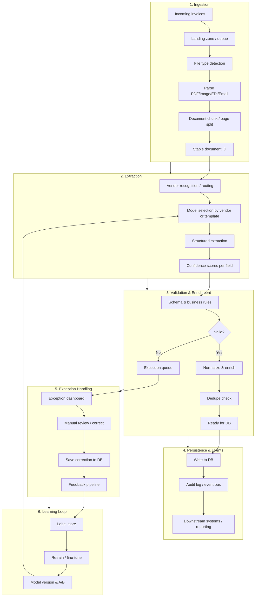
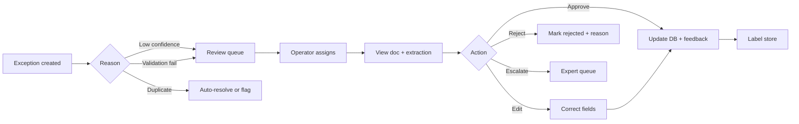
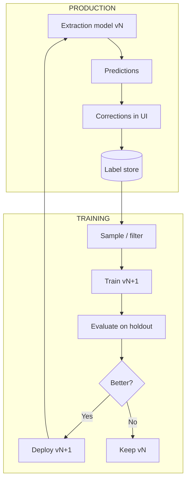
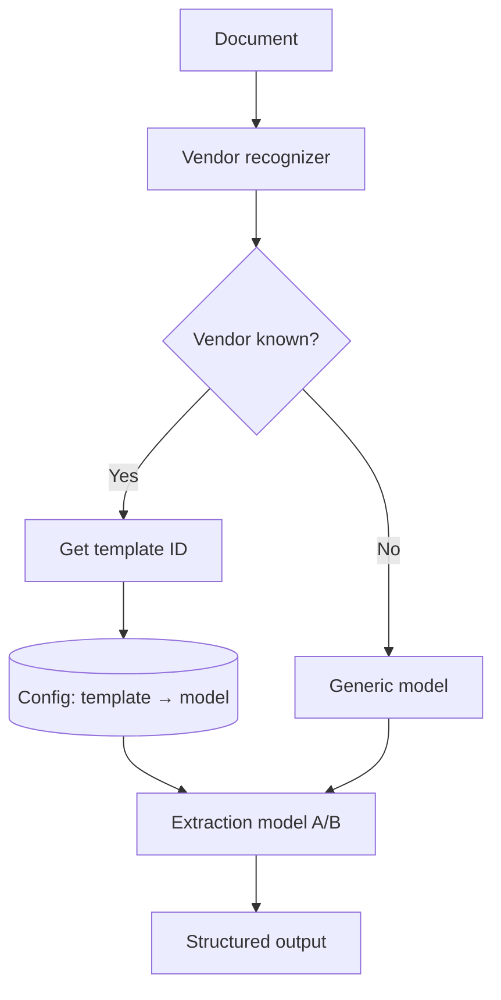
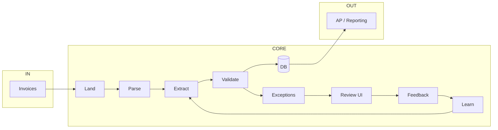

# Enterprise Invoice Processing System — Architecture & Process

**Context:** ~8,000 invoices/day from thousands of vendors → auto-extract, persist to DB, track exceptions, learn from manual corrections.

---

## 1. High-Level Flowchart

---

## 2. Step-by-Step Process Description

### Phase 1 — Ingestion

| Step | Description |
|------|-------------|
| **1.1 Incoming invoices** | Invoices arrive via email (mailbox/API), SFTP, API uploads, or scan/print pipelines. Use a single **landing zone** (e.g. blob store + message queue) so every document has one entry point. |
| **1.2 Landing zone / queue** | Write raw files to object storage (e.g. S3/GCS) with a unique ID; publish a message (e.g. Kafka/SQS) with that ID and metadata (source, timestamp). Decouples receipt from processing and allows replay. |
| **1.3 File type detection** | Detect MIME type and format (PDF, image, EDI, XML, etc.). Route to the right parser; reject or quarantine unsupported types. |
| **1.4 Parse** | **PDF:** text extraction (and OCR fallback for scans). **Images:** OCR (Tesseract, cloud vision, or doc AI). **EDI/XML:** schema-based parsing. Output: text + optional layout (regions, tables). |
| **1.5 Chunk / page split** | Split multi-page PDFs into pages or logical sections. Assign a stable **document ID** (and page/section IDs) used everywhere (DB, exceptions, learning). |
| **1.6 Stable document ID** | One canonical ID per invoice (e.g. hash of content + source + timestamp, or vendor ref + number). Used for dedupe, audit, and linking corrections to the right document. |

**Output:** Normalized “document” records (ID, raw path, text/layout, metadata) ready for extraction.

---

### Phase 2 — Extraction

| Step | Description |
|------|-------------|
| **2.1 Vendor recognition / routing** | Identify vendor (template ID or vendor master key). Use: header/footer text, logo, domain from email, or a small classifier. Enables **vendor- or template-specific** models or rules. |
| **2.2 Model selection** | Per vendor/template: choose extraction model (generic vs fine-tuned), rule set, or hybrid. Store mapping in config DB. |
| **2.3 Structured extraction** | Extract fields: invoice number, date, due date, line items (description, qty, unit price, amount), totals, tax, vendor details, PO/contract refs. Use: LLM + structured output, doc AI, or traditional ML + rules. |
| **2.4 Confidence per field** | For each field, output a confidence score (0–1). Low confidence → flag for review or exception. Enables **selective** human-in-the-loop. |

**Output:** Structured payload (e.g. JSON) plus confidence scores; link to document ID.

---

### Phase 3 — Validation & Enrichment

| Step | Description |
|------|-------------|
| **3.1 Schema & business rules** | Validate types (dates, numbers), required fields present, totals match line items, currency consistency. Check against **vendor master** (allowed vendors, payment terms). Flag duplicates (same vendor + invoice number). |
| **3.2 Valid?** | If all rules pass and confidence is above threshold → **Ready for DB**. Otherwise → send to **exception queue** with reason codes (e.g. low_confidence, total_mismatch, unknown_vendor). |
| **3.3 Normalize & enrich** | Normalize dates, currencies, units; resolve vendor ID from master data; attach cost center/GL from rules or lookup. |
| **3.4 Dedupe check** | Query DB (and/or cache) for same vendor + invoice number (and optional document hash). If duplicate → exception or skip; otherwise proceed. |
| **3.5 Ready for DB** | Final payload: document ID, extracted + normalized fields, validation flags, processing timestamp. |

**Output:** Either a “clean” record for persistence or an exception record with reason and payload for review.

---

### Phase 4 — Persistence & Events

| Step | Description |
|------|-------------|
| **4.1 Write to DB** | Write to **invoices** (and related **line_items**) tables; use transactions. Store document ID, raw file path or blob ref, extracted JSON, and status. Optionally version rows for audit. |
| **4.2 Audit log / event bus** | Publish event (e.g. “Invoice.Processed” or “Invoice.Exception”) with IDs and key fields. Enables dashboards, reporting, and downstream systems (AP, analytics) without coupling. |
| **4.3 Downstream** | Downstream systems consume events or query DB: AP workflow, reporting, reconciliation. |

**Output:** Invoice data in DB; events for observability and integration.

---

### Phase 5 — Exception Handling

| Step | Description |
|------|-------------|
| **5.1 Exception dashboard** | UI listing exceptions with filters (reason, vendor, date). Show document preview, extracted values, confidence, and reason code. |
| **5.2 Manual review / correct** | Operator corrects or confirms fields (and can add notes). Actions: Approve as-is, Edit then approve, Reject, or Escalate. |
| **5.3 Save correction to DB** | Persist corrected values to DB; mark invoice status (e.g. approved, rejected); store “corrected” snapshot and who/when. |
| **5.4 Feedback pipeline** | Every correction (original extraction vs human-approved) is written to a **label store** (document ID, field, model version, original value, corrected value, timestamp). This is the dataset for learning. |

**Output:** Exceptions resolved; all corrections logged for model improvement.

---

### Phase 6 — Learning Loop

| Step | Description |
|------|-------------|
| **6.1 Label store** | Append-only store of (document_id, field, model_version, predicted_value, corrected_value). Optionally link to vendor/template. |
| **6.2 Retrain / fine-tune** | Periodically (or on threshold): build training batches from label store; retrain or fine-tune extraction model (e.g. per vendor or per field). Version models (e.g. v1, v2). |
| **6.3 Model version & A/B** | New model is deployed as new version; route a % of traffic (e.g. by vendor or random) to new model. Compare exception rate and correction rate; promote if better. |
| **6.4 Back into extraction** | Promoted model becomes default for the relevant vendor/template in step 2.2. |

**Output:** Models that improve over time from production corrections; fewer exceptions and less manual work.

---

## 3. Supporting Flowcharts

### 3a. Exception Handling Detail

### 3b. Learning Feedback Loop

### 3c. Vendor / Template Routing

---

## 4. How to Start the Process (Practical Order)

1. **Define the data model**  
   Tables: invoices (header + metadata), line_items, documents (raw ref + parsed text), exceptions, label_store. Decide retention and audit requirements.

2. **Stand up ingestion**  
   One landing zone (blob + queue), one document ID strategy, and parsing for your main formats (PDF + OCR). Get “document in → document record out” working first.

3. **Extraction MVP**  
   Start with one vendor or one template; use a single model (e.g. doc AI or LLM with structured output). Emit structured JSON + per-field confidence.

4. **Validation & DB write**  
   Implement schema + business rules and write “valid” extractions to DB; send failures to an exception table with reason codes.

5. **Exception UI**  
   Simple list/detail view: show exception, document preview, extracted vs corrected, and persist corrections to DB and to the label store.

6. **Learning pipeline**  
   Use label store to evaluate and retrain; add model versioning and A/B routing so new models can be rolled out safely.

7. **Scale and harden**  
   Add vendors/templates, tune confidence thresholds, add retries and dead-letter queues, monitoring, and SLAs.

---

## 5. One-Page Visual Summary

---

*This document is a conceptual architecture. Implementation choices (cloud, queue, model type, DB) depend on your stack, compliance, and scale.*
